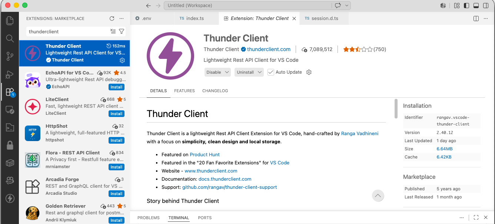
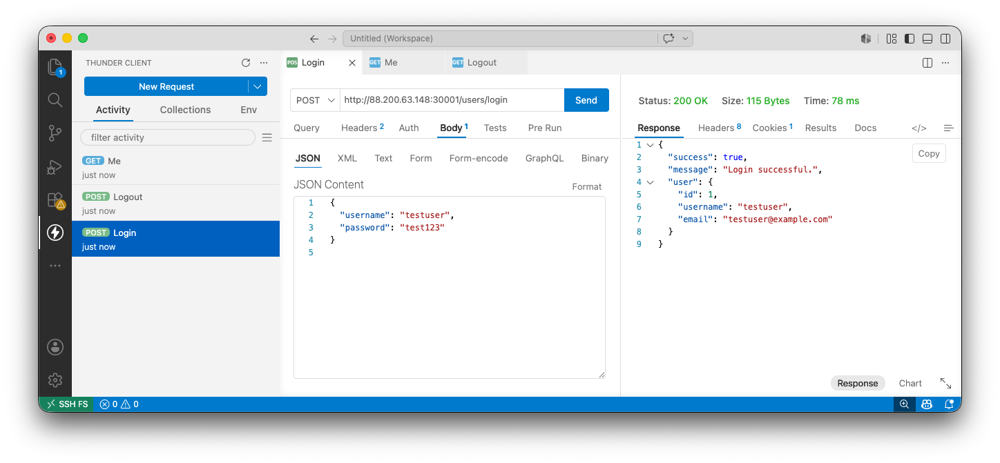

# Topics: Cookies, sessions and news images

The aim of this tutorial is to extend the existing application with:

* cookies and sessions;
* protected API endpoints;
* different navigation menus for logged-in and logged-out users;
* image upload when creating news.

In the previous tutorials, we created:

* a Node.js, Express and TypeScript back-end API;
* a MySQL database with tables for news and users;
* API endpoints for news and user login;
* a front-end application that calls the back-end API.

In this tutorial, we will add login state to the application. Users will be able to log in, the server will remember them using a session, and selected endpoints will be accessible only to logged-in users.

We will also update news creation so that a news item can have an image. The image will be shown only on the single news page.

---

# Part 1: Cookies and sessions

## 1. What are cookies?

A cookie is a small piece of data stored in the user's browser.

The server can send a cookie to the browser. The browser can then send that cookie back to the server with future requests.

Cookies are often used for:

* session identifiers;
* login state;
* language preferences;
* simple user preferences.

A cookie can look like this:

```text
connect.sid=s%3Aabc123
```

In this tutorial, the cookie will store the session identifier.

---

## 2. What are sessions?

A session is data stored on the server for a specific user.

The browser stores only the session cookie. The actual session data is stored on the server.

Example browser cookie:

```text
connect.sid=abc123
```

Example server-side session data:

```ts
{
  user: {
    id: 1,
    username: "testuser",
    email: "testuser@example.com"
  }
}
```

This means that the browser does not need to store the complete user object. It only stores the session identifier.

---

## 3. Install session dependencies

Move into the backend_klen folder:

```console
cd backend_klen
```

Install `express-session`:

```console
npm install express-session
```

Install TypeScript types:

```console
npm install --save-dev @types/express-session
```

Explanation:

```console
express-session
```

creates and manages sessions.

```console
@types/express-session
```

provides TypeScript types for `express-session`.

---

## 4. Add a session secret to `.env`

Open the back-end `.env` file.

Add:

```text
SESSION_SECRET=change-this-secret
```

Example `.env` file:

```text
PORT=5000
DB_HOST=localhost
DB_USER=see-eclassroom
DB_PASS=see-eclassroom
DB_DATABASE=frameworks_tutorial
SESSION_SECRET=change-this-secret
```

Important: in a real application, the session secret should be long and difficult to guess.

---

## 5. Configure sessions in `src/index.ts`

Open:

```text
src/index.ts
```

Import `express-session`:

```ts
import session from "express-session";
```

Add the session middleware before registering routes:

```ts
app.use(
  session({
    secret: process.env.SESSION_SECRET || "temporary-development-secret",
    resave: false,
    saveUninitialized: false,
    cookie: {
      httpOnly: true,
      sameSite: "lax",
      secure: false,
      maxAge: 1000 * 60 * 60,
    },
  })
);
```

After modification, `src/index.ts` should look similar to this:

```ts
import "dotenv/config";
import express, { Request, Response, NextFunction } from "express";
import newsRouter from "./routes/news.routes.js";
import usersRouter from "./routes/users.routes.js";
import cors from "cors";
import path from "path";
import session from "express-session";

const app = express();
const port = Number(process.env.PORT) || 5000;
app.use(cors());
app.use(
  session({
    secret: process.env.SESSION_SECRET || "temporary-development-secret",
    resave: false,
    saveUninitialized: false,
    cookie: {
      httpOnly: true,
      sameSite: "lax",
      secure: false,
      maxAge: 1000 * 60 * 60,
    },
  })
);
app.use(express.json());
app.use(express.urlencoded({ extended: false }));

console.log("Curent dir: " + __dirname);
app.use(express.static(path.join(__dirname, "frontend-build")));
app.get("/", (req, res) => {
  res.sendFile(path.join(__dirname, "index.html"))
})


app.use("/news", newsRouter);
app.use("/users", usersRouter);

app.use((error: unknown, _req: Request, res: Response, _next: NextFunction) => {
  console.error(error);

  res.status(500).json({
    success: false,
    message: "Internal server error",
  });
});

app.listen(port, () => {
  console.log(`Server is running on port: ${port}`);
});
```

---

## 6. Add TypeScript session types

Create a new file:

```text
src/session.d.ts
```

Add:

```ts
import "express-session";

declare module "express-session" {
  interface SessionData {
    user?: {
      id: number;
      username: string;
      email: string;
    };
  }
}
```

This tells TypeScript that `req.session` may contain a `user` object.

Without this file, TypeScript may report an error when you write:

```ts
req.session.user = {
  id: user.id,
  username: user.user_name,
  email: user.user_email,
};
```

---

# Part 2: Login state

## 1. Store the user in the session after login

Open:

```text
src/routes/users.routes.ts
```

Find the `loginUser` function.

After successful password validation, store the user in the session:

```ts
req.session.user = {
  id: user.id,
  username: user.user_name,
  email: user.user_email,
};
```

The updated `loginUser` function should look like this:

```ts
const loginUser = async (
  req: Request,
  res: Response,
  next: NextFunction
) => {
  try {
    const { username, password } = req.body as {
      username?: string;
      password?: string;
    };

    if (!username || !password) {
      res.status(400).json({
        success: false,
        message: "Username and password are required.",
      });

      return;
    }

    const queryResult = await authUser(username);

    if (queryResult.length === 0) {
      res.status(401).json({
        success: false,
        message: "User is not registered.",
      });

      return;
    }

    const user = queryResult[0];

    if (password !== user.user_password) {
      res.status(401).json({
        success: false,
        message: "Incorrect password.",
      });

      return;
    }

    req.session.user = {
      id: user.id,
      username: user.user_name,
      email: user.user_email,
    };

    res.status(200).json({
      success: true,
      message: "Login successful.",
      user: {
        id: user.id,
        username: user.user_name,
        email: user.user_email,
      },
    });
  } catch (error) {
    next(error);
  }
};
```

---

## 2. Add endpoint for checking session state

Add the following function in `src/routes/users.routes.ts`:

```ts
const getCurrentUser = (
  req: Request,
  res: Response
) => {
  if (!req.session.user) {
    res.status(200).json({
      loggedIn: false,
      user: null,
    });

    return;
  }

  res.status(200).json({
    loggedIn: true,
    user: req.session.user,
  });
};
```

Register the route:

```ts
router.get("/me", getCurrentUser);
```

## 3. Test new endpoint 

To test endpoints that use sessions, please install the Thunder Client extension in Visual Studio Code.


You can test it with:

```text
GET http://ADDRESS:PORT/users/me
POST http://ADDRESS:PORT/users/login
GET http://ADDRESS:PORT/users/me
```



If the user is not logged in, the response should be:

```json
{
  "loggedIn": false,
  "user": null
}
```

If the user is logged in, the response should be:

```json
{
  "loggedIn": true,
  "user": {
    "id": 1,
    "username": "testuser",
    "email": "testuser@example.com"
  }
}
```

## Troubleshooting

If you are testing this functionality using Postman or hoppscotch.io, we recommend using their desktop applications. Browser-based versions may have difficulty handling cookies, which are required for session-based functionality to work correctly.

## 4. Add logout endpoint

Add the following function in `src/routes/users.routes.ts`:

```ts
const logoutUser = (
  req: Request,
  res: Response,
  next: NextFunction
) => {
  req.session.destroy((error) => {
    if (error) {
      next(error);
      return;
    }

    res.clearCookie("connect.sid");

    res.status(200).json({
      success: true,
      message: "Logout successful.",
    });
  });
};
```

Register the route:

```ts
router.post("/logout", logoutUser);
```

---

## 5. Test login and logout functionality

Start the server:

```console
npm run dev
```

Test the following flow:

```text
POST /users/login
GET /users/me
POST /users/logout
GET /users/me
```

After login, `/users/me` should return:

```json
{
  "loggedIn": true
}
```

After logout, `/users/me` should return:

```json
{
  "loggedIn": false,
  "user": null
}
```

---

# Part 3: Protected endpoints

## 1. Create login middleware

Create a new folder in backend_klen:

```console
mkdir -p src/middleware
```

Create a new file:

```text
src/middleware/require-login.ts
```

Add:

```ts
import { Request, Response, NextFunction } from "express";

export const requireLogin = (
  req: Request,
  res: Response,
  next: NextFunction
) => {
  if (!req.session.user) {
    res.status(401).json({
      success: false,
      message: "You must be logged in to access this endpoint.",
    });

    return;
  }

  next();
};
```

This middleware checks whether the session contains a logged-in user.

If the user is not logged in, the request stops.

If the user is logged in, the request continues.

---

## 2. Protect news endpoints

Open:

```text
src/routes/news.routes.ts
```

Import the middleware:

```ts
import { requireLogin } from "../middleware/require-login.js";
```

Everyone should be able to read news:

```ts
router.get("/", getAllNews);
router.get("/:id", getOneNewsItem);
```

Only logged-in users should be able to create, update or delete news:

```ts
router.post("/", requireLogin, addNewsItem);
router.put("/:id", requireLogin, editNewsItem);
router.delete("/:id", requireLogin, removeNewsItem);
```

The final route registration should look like this:

```ts
router.get("/", getAllNews);
router.get("/:id", getOneNewsItem);
router.post("/", requireLogin, addNewsItem);
router.put("/:id", requireLogin, editNewsItem);
router.delete("/:id", requireLogin, removeNewsItem);
```

---

## 3. Test protected endpoints

Without logging in, try:

```text
POST http://ADDRESS:PORT/news
```

Expected response:

```json
{
  "success": false,
  "message": "You must be logged in to access this endpoint."
}
```

Then log in:

```text
POST http://ADDRESS:PORT/users/login
```

After login, try again:

```text
POST http://ADDRESS:PORT/news
```

Now the endpoint should be accessible.

---

# Part 4: Conditional menu based on session state

In this part, we will update the **front end** so that the navigation menu changes depending on whether the user is logged in.

The back end already provides this endpoint:

```text
GET http://ADDRESS:PORT/users/me
```

This endpoint tells the front end whether the current browser session belongs to a logged-in user.

---

## 2. Create a session helper file in front-end

Create this file:

```text
frontend_klen/src/api/session.ts
```

Add:

```ts
import { API_URL } from "../config/api";

export type SessionUser = {
  id: number;
  username: string;
  email: string;
};

export type SessionResponse = {
  loggedIn: boolean;
  user: SessionUser | null;
};

export const getCurrentSession = async (): Promise<SessionResponse> => {
  const response = await fetch(`${API_URL}/users/me`, {
    credentials: "include",
  });

  return response.json();
};

export const logoutUser = async (): Promise<void> => {
  await fetch(`${API_URL}/users/logout`, {
    method: "POST",
    credentials: "include",
  });
};
```

The important part is:

```ts
credentials: "include"
```

This allows the browser to send the session cookie to the back end.

Without it, the back end may respond as if the user is not logged in.

---

## 3. Update a navigation component

Update this file:

```text
frontend_klen/src/components/Menu.tsx
```

Add:

```tsx
import { Link, useLocation, useNavigate } from "react-router";
import { useEffect, useState } from "react";

import {
  getCurrentSession,
  logoutUser
} from "../api/session";

export default function Menu() {
  const [user, setUser] = useState(null);
  const [isLoading, setIsLoading] = useState(true);

  const location = useLocation();
  const navigate = useNavigate();

  const loadSession = async () => {
    setIsLoading(true);

    try {
      const session = await getCurrentSession();

      if (session.loggedIn) {
        setUser(session.user);
      } else {
        setUser(null);
      }
    } catch (error) {
      console.error("Failed to load session:", error);
      setUser(null);
    } finally {
      setIsLoading(false);
    }
  };

  const handleLogout = async () => {
    await logoutUser();
    setUser(null);
    navigate("/login");
  };

  useEffect(() => {
    loadSession();
  }, [location.pathname]);

  if (isLoading) {
    return <nav>Loading menu...</nav>;
  }

  if (!user) {
    return (
      <nav>
        <Link to="/news">News</Link>
        <Link to="/about">About</Link>
        <Link to="/login">Login</Link>
        <Link to="/register">Register</Link>
      </nav>
    );
  }

  return (
    <nav>
      <Link to="/news">News</Link>
      <Link to="/about">About</Link>
      <Link to="/create-news">Create News</Link>
      <span>Logged in as: {user.username}</span>
      <button onClick={handleLogout}>Logout</button>
    </nav>
  );
}

```

This component does three things:

1. Calls `/users/me` when the page loads.
2. Shows the guest menu if the user is not logged in.
3. Shows the logged-in menu if the user is logged in.

---

# Update `index.css`

Open the front-end stylesheet:

```text
frontend_klen/src/index.css
```

Add the following CSS rule at the end:

```css
span {
  padding: 10px 18px;
  border-radius: 10px;
  color: #374151;
  font-size: 1.2rem;
  font-weight: 700;
}
```

This style is used to make text inside `<span>` elements more visible, for example:

```jsx
<span>Logged in as testuser</span>
```

## 5. Update the login page

After a successful login, the browser receives a session cookie from the back end.

In your login page

```text
frontend_klen/src/pages/Login.jsx
```

make sure the login request also uses:

```ts
credentials: "include"
```
And redirect/reload after successful login.

```ts
window.location.href = "/";
```

Example:

```tsx
import { useState } from "react";
import { API_URL } from "../config/api";

export default function Login() {
  const [username, setUsername] = useState("");
  const [password, setPassword] = useState("");
  const [message, setMessage] = useState("");

  const handleLogin = async (event) => {
    event.preventDefault();
    setMessage("");

    try {
      const res = await fetch(`${API_URL}/users/login`, {
        method: "POST",
        headers: {
          "Content-Type": "application/json",
        },
        credentials: "include",
        body: JSON.stringify({
          username,
          password,
        }),
      });

      const data = await res.json();
      console.log("Login response:", data);

      if (res.ok) {
        localStorage.setItem("user", JSON.stringify(data.user));
        setMessage("Login successful.");
         window.location.href = "/";
      } else {
        setMessage(data.message || "Login failed.");
      }
    } catch (err) {
      console.log("Login error:", err);
      setMessage("Login error. Please try again.");
    }
  };

  return (
    <main className="login-page">
      <section className="login-card">
        <h1>Login</h1>

        <form onSubmit={handleLogin}>
          <div>
            <label>Username</label>
            <input
              type="text"
              value={username}
              onChange={(event) => setUsername(event.target.value)}
            />
          </div>

          <div>
            <label>Password</label>
            <input
              type="password"
              value={password}
              onChange={(event) => setPassword(event.target.value)}
            />
          </div>

          <button type="submit">Login</button>
        </form>

        {message && <p>{message}</p>}
      </section>
    </main>
  );
}
```

Important: if `credentials: "include"` is missing from the login request, the browser may not store or send the session cookie correctly.

---

## 6. Update protected front-end pages

If you have a page for creating news, for example:

```text
src/pages/CreateNewsPage.tsx
```

you should also check the session before showing the form.

Example:

```tsx
import { useEffect, useState } from "react";
import { getCurrentSession } from "../api/session";

const CreateNewsPage = () => {
  const [canAccess, setCanAccess] = useState(false);
  const [isLoading, setIsLoading] = useState(true);

  useEffect(() => {
    const checkAccess = async () => {
      const session = await getCurrentSession();

      setCanAccess(session.loggedIn);
      setIsLoading(false);
    };

    checkAccess();
  }, []);

  if (isLoading) {
    return <p>Checking login state...</p>;
  }

  if (!canAccess) {
    return <p>You must be logged in to create news.</p>;
  }

  return (
    <div>
      <h1>Create news</h1>
      {/* Create news form goes here */}
    </div>
  );
};

export default CreateNewsPage;
```

This improves the user experience, but remember:

> The real protection must still happen on the back end.

The front end can hide a page or button, but users can still manually call API endpoints. Therefore, protected endpoints must also use back-end middleware such as `requireLogin`.

---

## 8. Testing checklist

Check the following:

```text
[ ] The login request uses credentials: "include".
[ ] The /users/me request uses credentials: "include".
[ ] The logout request uses credentials: "include".
[ ] The back end uses cors({ origin: "...", credentials: true }).
[ ] The Menu component is imported in App.tsx.
[ ] Logged-out users see Home, News, Login and Register.
[ ] Logged-in users see Home, News, Create news, username and Logout.
[ ] Clicking Logout changes the menu back to the guest menu.
[ ] Protected pages are hidden or blocked on the front end.
[ ] Protected endpoints are still protected on the back end.
```

# Part 5: Image upload for news

## 1. Update the database

The current `news` table stores only text data. Add a new column for the uploaded image path.

Run this SQL in phpMyAdmin:

```sql
USE frameworks_tutorial;

ALTER TABLE news
ADD COLUMN image_path VARCHAR(255) NULL AFTER text;
```

After this change, the `news` table should contain:

```text
id
title
slug
text
image_path
created_at
updated_at
```

The `image_path` column is nullable because not every news item needs to have an image.

---

## 2. Install upload dependencies

Install `multer`:

```console
npm install multer
```

Install TypeScript types:

```console
npm install --save-dev @types/multer
```

Explanation:

```console
multer
```

processes files uploaded with `multipart/form-data`.

---

## 3. Create upload folder

Create a folder for uploaded news images:

```console
mkdir -p src/uploads/news
```

The project structure should include:

```text
src/
├── db/
│   └── database.ts
├── middleware/
│   └── require-login.ts
├── routes/
│   ├── news.routes.ts
│   └── users.routes.ts
├── uploads/
│   └── news/
└── index.ts
```

---

## 4. Serve uploaded files

Open:

```text
src/index.ts
```

Add this line before registering routes:

```ts
app.use("/uploads", express.static("src/uploads"));
```

This makes uploaded files available through URLs such as:

```text
http://ADDRESS:PORT/uploads/news/example.jpg
```

---

## 5. Update the news database interface

Open:

```text
src/db/database.ts
```

Update the `NewsItem` interface:

```ts
export interface NewsItem extends RowDataPacket {
  id: number;
  title: string;
  slug: string;
  text: string;
  image_path: string | null;
}
```

---

## 6. Update `createNewsItem`

In `src/db/database.ts`, replace the old `createNewsItem` function with:

```ts
export const createNewsItem = async (
  title: string,
  slug: string,
  text: string,
  imagePath: string | null
): Promise<ResultSetHeader> => {
  const [result] = await pool.query<ResultSetHeader>(
    "INSERT INTO news (title, slug, text, image_path) VALUES (?, ?, ?, ?)",
    [title, slug, text, imagePath]
  );

  return result;
};
```

---

## 7. Configure `multer`

Open:

```text
src/routes/news.routes.ts
```

Add imports:

```ts
import multer from "multer";
import path from "node:path";
```

Add the upload configuration:

```ts
const storage = multer.diskStorage({
  destination: (_req, _file, callback) => {
    callback(null, "src/uploads/news");
  },
  filename: (_req, file, callback) => {
    const uniquePrefix = Date.now();
    const safeOriginalName = file.originalname.replaceAll(" ", "-");

    callback(null, `${uniquePrefix}-${safeOriginalName}`);
  },
});

const upload = multer({ storage });
```

---

## 8. Update `addNewsItem`

Update the `addNewsItem` function in `src/routes/news.routes.ts`:

```ts
const addNewsItem = async (
  req: Request,
  res: Response,
  next: NextFunction
) => {
  try {
    let { title, slug, text } = req.body as {
      title?: string;
      slug?: string;
      text?: string;
    };

    title = title?.trim();
    slug = slug?.trim();
    text = text?.trim();

    if (!title || !slug || !text) {
      res.status(400).json({
        success: false,
        message: "Title, slug and text are required.",
      });

      return;
    }

    const imagePath = req.file
      ? path.posix.join("uploads", "news", req.file.filename)
      : null;

    const queryResult = await createNewsItem(title, slug, text, imagePath);

    if (queryResult.affectedRows === 1) {
      res.status(201).json({
        success: true,
        message: "News item added.",
      });

      return;
    }

    res.status(500).json({
      success: false,
      message: "News item was not added.",
    });
  } catch (error) {
    next(error);
  }
};
```

Update the route registration:

```ts
router.post("/", requireLogin, upload.single("image"), addNewsItem);
```

The uploaded image field must be named:

```text
image
```

---

## 9. Test image upload

Important: because this endpoint is protected, log in first.

Recommended testing order:

```text
POST /users/login
POST /news
GET /news
GET /news/:id
```

For `POST /news`, use:

```text
multipart/form-data
```

Fields:

```text
title: News item with image
slug: news-item-with-image
text: This news item has an uploaded image.
image: choose a local image file
```

If file upload does not work in Thunder Client, test the endpoint with `curl`. Some GUI API clients may incorrectly set the multipart request headers or fail to send the file field correctly.

A working curl example:

```console
curl -i -c cookies.txt -X POST http://88.200.63.148:30001/users/login   -H "Content-Type: application/json"   -d '{"username":"testuser","password":"test123"}'

curl -i -b cookies.txt -X POST http://88.200.63.148:30001/news \
  -F "title=News with image" \
  -F "slug=news-with-image_" \
  -F "text=This news item has an image." \
  -F "image=@/full/path/to/your/image.png"
```
---

# Part 6: Show the image only on the single news page


The single news page should show:

* title;
* full text;
* image, if available.

Example:

```ts
return (
    <main className="single-news-page">
      <Link to="/news">Back to news</Link>

      <article>
        <h1>{newsItem.title}</h1>
        <p>Published: {formatDate(newsItem.created_at)}</p>
        <p>{newsItem.text}</p>
         {newsItem.image_path && (
          
        )}
        <button onClick={deleteNews}>Delete news</button>
      </article>
    </main>
  );
}
```

---

# Testing checklist

Before finishing, check:

```text
[ ] express-session is installed.
[ ] SESSION_SECRET is added to .env.
[ ] Sessions are configured in src/index.ts.
[ ] src/session.d.ts is created.
[ ] Login stores the user in req.session.user.
[ ] GET /users/me returns the current session state.
[ ] POST /users/logout destroys the session.
[ ] Protected endpoints return 401 for guests.
[ ] Logged-in users can access protected endpoints.
[ ] The front end sends requests with credentials: "include".
[ ] The guest menu is shown to logged-out users.
[ ] The logged-in menu is shown to logged-in users.
[ ] The news table contains image_path.
[ ] multer is installed.
[ ] src/uploads/news exists.
[ ] POST /news accepts multipart/form-data.
[ ] The single news page shows the image.
[ ] The news list page does not show the image.
```

---

# Complete flow

## Back end

```console
cd back-end
npm install
npm install express-session multer
npm install --save-dev @types/express-session @types/multer
mkdir -p src/middleware
mkdir -p src/uploads/news
npm run dev
```

## Database

```sql
USE frameworks_tutorial;

ALTER TABLE news
ADD COLUMN image_path VARCHAR(255) NULL AFTER text;
```

## Test session flow

```text
POST /users/login
GET /users/me
POST /users/logout
GET /users/me
```

## Test protected news flow

```text
POST /users/login
POST /news
PUT /news/:id
DELETE /news/:id
```

## Test image flow

```text
POST /users/login
POST /news with multipart/form-data and image field
GET /news/:id
```

---

# Exercises: Image support for news

## Exercise 1: Add image support to the create news form

Update the front-end create news page so that a user can create a news item either with or without an image.

The form should include the following fields:

```text
title
slug
text
image
```

The `image` field should be optional.

Because the form can include a file, the request should use `FormData` instead of JSON.

Expected behavior:

- if the user selects an image, the image is uploaded together with the news item;
- if the user does not select an image, the news item is still created without an image;
- after successful creation, the form is cleared or the user is redirected to the news list;
- if the user is not logged in, the request should fail and show an appropriate message.

---

## Exercise 2: Add edit news functionality to the single news page

Update the single news page so that a logged-in user can edit an existing news item.

The single news page should include an **Edit news** option, for example a button or link.

The edit form should allow the user to update:

```text
title
slug
text
image
```

The `image` field should be optional.

Expected behavior:

- if the user changes only `title`, `slug` or `text`, the existing image should remain unchanged;
- if the user selects a new image, the old image path should be replaced with the new uploaded image path;
- after successful update, the user should see the updated single news page;
- if the news item does not exist, show a “News item not found” message;
- if the user is not logged in, the update request should fail and show an appropriate message.

